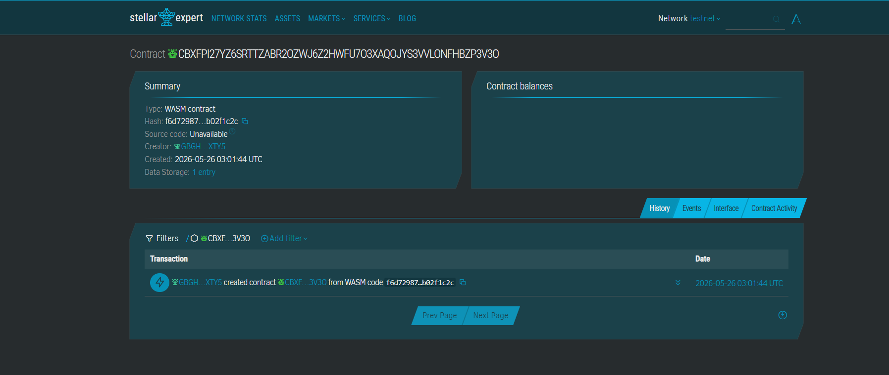

💊 MedChain — Fake Medicine Detection on Stellar

A Soroban-powered blockchain system that verifies pharmaceutical authenticity, prevents counterfeit drugs, and enables transparent batch tracking using the Stellar testnet.

📌 PROJECT NAME

MedChain

🚨 PROBLEM

In developing regions such as Southeast Asia and Africa, pharmacies and patients often cannot verify whether medicines are authentic, expired, or recalled. Counterfeit drugs circulate through informal supply chains, leading to ineffective treatment, financial loss, and serious health risks due to lack of a trusted verification system.

💡 SOLUTION

MedChain allows pharmaceutical manufacturers to register medicine batches on the Stellar blockchain using Soroban smart contracts. Pharmacies and patients can instantly verify authenticity, expiry status, and recall status by scanning a batch ID or QR code, ensuring trust without intermediaries.

⚙️ STELLAR FEATURES USED
✅ Soroban Smart Contracts
✅ Testnet Deployment
✅ Contract state storage
✅ Transaction signing via Freighter wallet
✅ On-chain verification logic
🎯 TARGET USERS
Pharmacies in developing countries (SEA, Africa, LATAM)
Pharmaceutical manufacturers
Patients purchasing medicine in informal markets
Healthcare distributors needing traceability
🧩 CORE FEATURE (MVP)

User action → On-chain action → Result

Manufacturer registers a medicine batch (batch ID, expiry, manufacturer)
Data is stored on Stellar Soroban smart contract
Pharmacy or patient enters batch ID
Smart contract verifies:
Exists / not fake
Not recalled
Not expired
System returns authenticity status instantly
🏆 WHY THIS WINS

MedChain solves a real-world, life-critical problem using Soroban smart contracts with immediate verifiability. It demonstrates real on-chain state transitions (register → verify → recall) and shows how Stellar can secure physical-world supply chains in high-risk markets.

🚀 OPTIONAL EDGE
Freighter wallet integration for real signing
QR-code based batch verification (mobile-first UX)
Recall mechanism for emergency drug withdrawal
Expandable to supply chain tracking (logistics layer)
🌍 CONSTRAINTS

Region:

Southeast Asia
Africa
LATAM

User Type:

SMEs
Pharmacies
Healthcare supply chains

Complexity:

Soroban required
Web app
Mobile-friendly UI

Theme:

Supply Chain Integrity
Healthcare Safety
SME Merchant Systems
🔧 SOROBAN SMART CONTRACT
Functions implemented:
register_batch
verify_batch
recall_batch
get_batch_count
📂 PROJECT STRUCTURE
medchain/
│
├── contracts/
│   └── notes/
│       ├── src/lib.rs
│       ├── Cargo.toml
│
├── frontend/
│   ├── index.html
│
└── README.md
🧪 BUILD & TEST
Build contract
stellar contract build
Deploy to testnet
stellar contract deploy \
  --wasm target/wasm32v1-none/release/medchain.wasm \
  --source alice \
  --network testnet
Invoke contract (example)
stellar contract invoke \
  --id <CONTRACT_ID> \
  --source alice \
  --network testnet \
  -- register_batch \
  --registrar <YOUR_ADDRESS> \
  --batch_id "B001" \
  --medicine_name "Paracetamol" \
  --manufacturer "Pfizer" \
  --manufacture_date "2025-01-01" \
  --expiry_date "2027-01-01"
🌐 FRONTEND

Open:

frontend/index.html

Then connect Freighter wallet and interact with:

Register batch
Verify medicine
Recall batch
⚡ VERCEL DEPLOYMENT
Push to GitHub
Import repo on Vercel
Set:
Framework: Other
Root: frontend
Deploy
📜 LICENSE

## SCREENSHOT

## CONTRACT_ID

CBXFPI27YZ6SRTTZABR2OZWJ6Z2HWFU7O3XAQOJYS3VVLONFHBZP3V3O

## LINK
https://stellar.expert/explorer/testnet/contract/CBXFPI27YZ6SRTTZABR2OZWJ6Z2HWFU7O3XAQOJYS3VVLONFHBZP3V3O

MIT License
